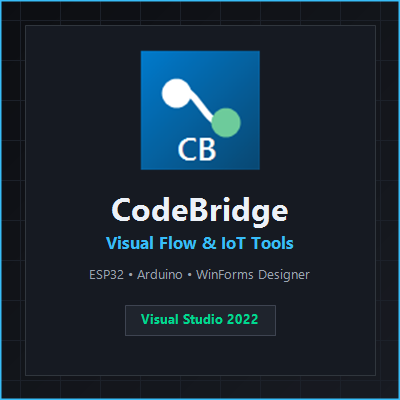

<p align="center">
  
</p>

# CodeBridge

[](https://github.com/Christian9005/CodeBrigde/actions/workflows/ci.yml)
[](https://www.nuget.org/packages/CodeBridge.ESP32)
[](https://marketplace.visualstudio.com/)
[](LICENSE)

**Control ESP32 and Arduino Uno boards from .NET: in C#, or with a visual flow editor inside Visual Studio.**
CodeBridge ships a bridge firmware for the board and a .NET SDK that talks to it over USB serial or Wi-Fi, so you write
C# instead of embedded C/C++.

## Two ways to use it

| You are... | Use | Start here |
|---|---|---|
| New to microcontrollers / prefer visual tools | **CodeBridge Visual Studio Tools** (VSIX) | [Getting started](docs/getting-started.md) |
| A .NET developer who wants the SDK directly | **NuGet packages** | [SDK quick start](#sdk-quick-start) |

## NuGet packages

| Package | Purpose | Target |
|---|---|---|
| `CodeBridge.Core` | Abstractions (`IBoard`, `ITransport`), wire protocol, exceptions | net8.0 |
| `CodeBridge.Transport` | Serial and TCP/Wi-Fi transports, USB board discovery | net8.0 (Windows for USB discovery) |
| `CodeBridge.ESP32` | ESP32 board + sensor/actuator drivers | net8.0 |
| `CodeBridge.Flow` | Flow document model, validation, runtime | net8.0 |
| `CodeBridge.Designer.WinForms` | WinForms Toolbox controls, designer, firmware flashing (ships the firmware) | net8.0-windows |

```powershell
dotnet add package CodeBridge.ESP32
```

## SDK quick start

Flash the firmware once (see [Getting started](docs/getting-started.md#flash-the-firmware)), then:

```csharp
using CodeBridge.Core;
using CodeBridge.Core.Enums;
using CodeBridge.ESP32;

await using var board = await CodeBridgeBuilder
    .Connect()
    .Serial("COM3", baudRate: 115200)   // or .WiFi("192.168.1.50")
    .ToESP32()
    .BuildAsync();

await board.Gpio.SetPinModeAsync(2, PinMode.Output);
await board.Gpio.DigitalWriteAsync(2, PinValue.High);

int raw = await board.Gpio.AnalogReadAsync(34);   // 12-bit ADC value
Console.WriteLine($"ADC34 = {raw}");
```

More runnable examples are in [`samples/`](samples) (blink, servo, motor/relay, Wi-Fi setup and diagnostics).
See the [API reference](docs/api-reference.md).

## Visual Studio extension

- **`.cbflow` visual flow editor**: drag blocks, wire ports, edit properties; follows the active Visual Studio theme.
  Its toolbar picks the board and port, tests the connection, uploads the firmware and runs the flow on the real board with live
  per-block status, undo/redo, copy/paste, multi-select and live validation. Hover any block for an animated explanation;
  five ready-made [examples](docs/examples.md) are available from *Add > New Item*, and *Tools > CodeBridge Tour*
  walks you from the first blink to using the SDK from a [console app, web API or Windows service](samples).
- **WinForms Toolbox components**: `CodeBridgeFlowControl` and `CodeBridgeEsp32Component` with Smart Tags to pick a COM port,
  detect the board and flash the firmware.
- **One-click firmware flashing for ESP32**: uses `esptool`, downloaded on first use over HTTPS and verified by SHA-256.
  No Python, PlatformIO or Arduino IDE needed. The firmware binaries ship inside `CodeBridge.Designer.WinForms`.
- **Project and item templates**, a setup window (*Tools > CodeBridge Setup...*) and a starter form command.
- **Automatic USB board detection** for CP210x, CH340/CH9102, FTDI and official Arduino adapters.

## Hardware support

| Board | Status |
|---|---|
| **ESP32 DevKit (esp32dev)** | Supported: GPIO, ADC, PWM, I2C, SPI, 1-Wire, interrupts, sensors, displays, Wi-Fi, prebuilt firmware |
| **Arduino Uno R3** | Basic: digital/analog I/O, PWM, servo via the bridge sketch. Flashing needs [`arduino-cli`](https://arduino.github.io/arduino-cli/) installed |
| ESP32-S2 / S3 / C3, Arduino Mega | Not validated. The SDK may work; firmware must be built yourself with PlatformIO (`firmware/esp32-bridge`) |
| STM32, PIC | Planned; `ToSTM32()` exists in the builder but there is no driver yet and building throws `NotSupportedException` |

Drivers included for ESP32: DHT11/22, DS18B20, BME280, BH1750, MPU6050, TCS34725, INA219, HC-SR04, PIR, gas sensors,
relays, buzzers, servos, DC/stepper motors, RGB LED, WS2812B NeoPixel, SSD1306 OLED, HD44780 I2C LCD, MQTT, OTA.

## Architecture

```
Visual Studio        .cbflow editor | WinForms Toolbox | Setup window
SDK (NuGet)          Flow -> Core <- Transport <- ESP32        (Designer.WinForms ties them together)
Board firmware       esp32-bridge (PlatformIO) | arduino-uno-bridge
```

## Security

- Downloaded tools (esptool) must use HTTPS and match a pinned SHA-256.
- Firmware flashing runs child processes that are killed (whole tree) on cancel, so serial ports are released.
- See [SECURITY.md](SECURITY.md) to report a vulnerability.

## Building from source

```powershell
./build/pack.ps1 -Vsix      # packs the 5 NuGet packages and builds the VSIX into artifacts/
dotnet test CodeBridge.slnx -c Release
```

Releasing is described in [docs/publishing.md](docs/publishing.md). Contributions are welcome: see [CONTRIBUTING.md](CONTRIBUTING.md)
and the [changelog](CHANGELOG.md).

## License

MIT, see [LICENSE](LICENSE).
